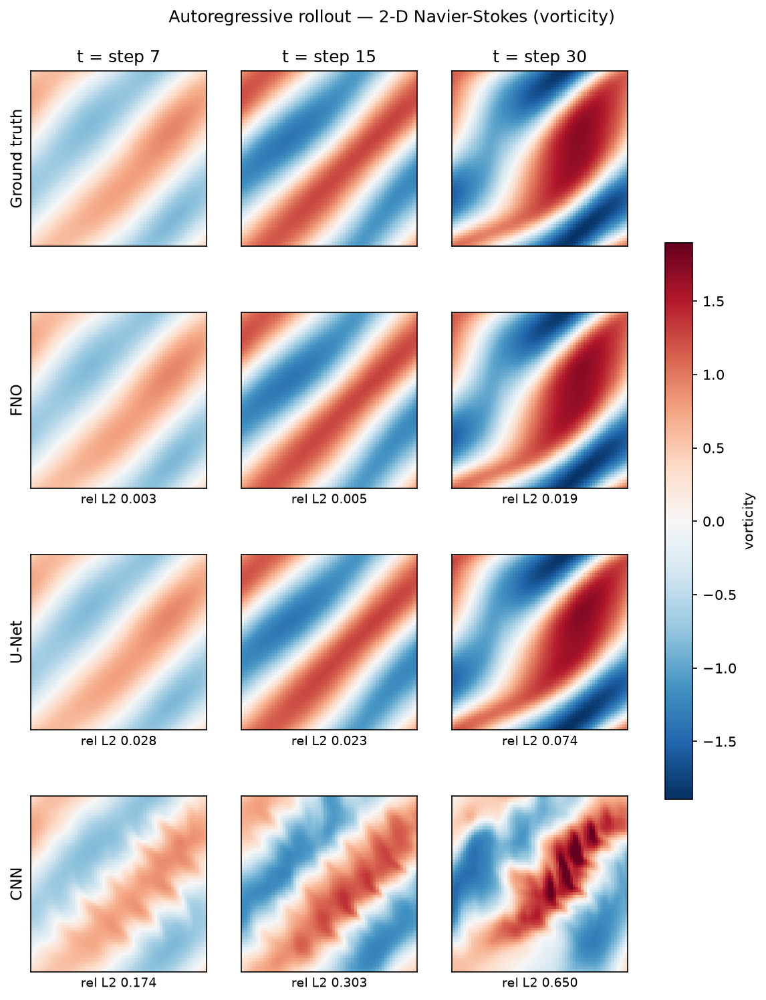
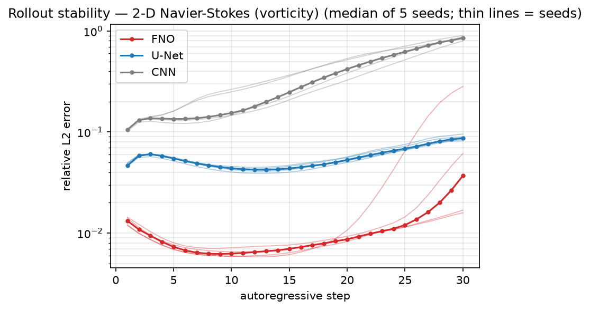
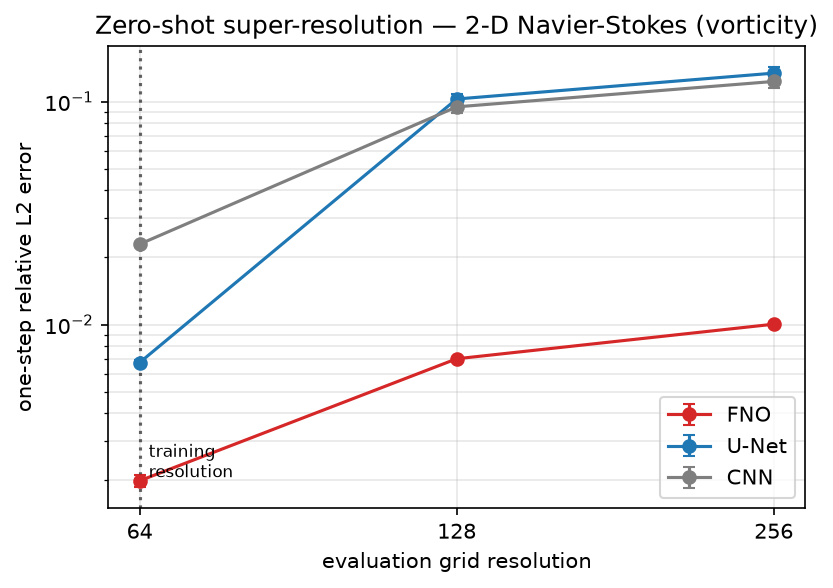
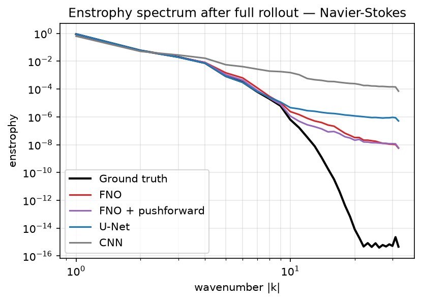
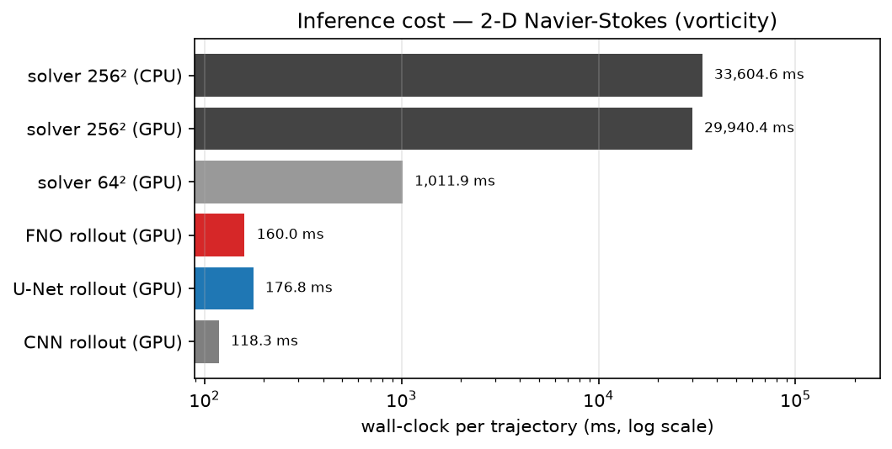
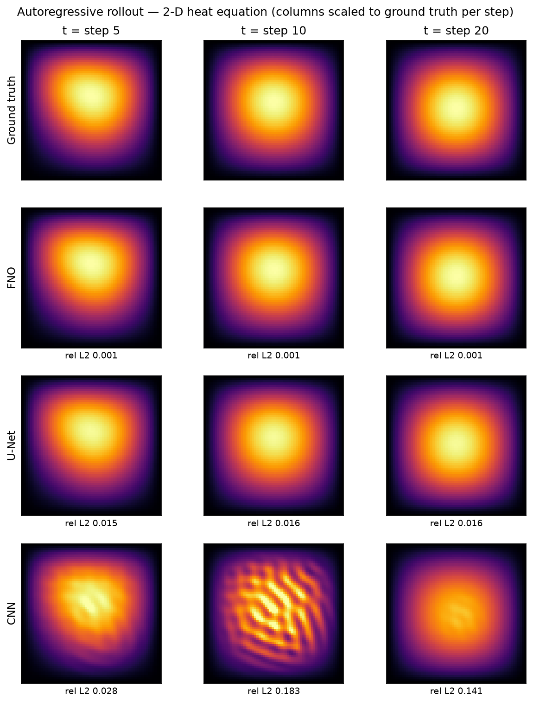

# Neural operators vs. convolutional baselines for PDE surrogate modeling

Can a learned operator replace a numerical PDE solver? This repo benchmarks a
**Fourier Neural Operator** (implemented from scratch) against two
**parameter-matched** convolutional baselines (U-Net, plain CNN) on two 2-D
problems: the heat equation and incompressible **Navier-Stokes** in vorticity
form. All models learn the one-step solution operator `u(t) → u(t + Δt)` and
are evaluated on one-step accuracy, autoregressive rollout stability,
**zero-shot super-resolution**, and wall-clock cost against the solver that
generated the data. Every configuration is trained with **5 random seeds**;
tables report mean ± std across seeds (rollouts: median and range, because
their seed distribution is skewed — see the stability note below).

**Headline results (Navier-Stokes, ν = 10⁻³, 5 seeds per model):**

- FNO reaches **0.20% ± 0.01** one-step relative L2 error — **3.4× more
  accurate than a parameter-matched U-Net** (0.68% ± 0.02) and 11× more
  accurate than a plain CNN (2.3% ± 0.06).
- A full 30-frame FNO rollout takes **160 ms** on an RTX 4050 Laptop GPU vs.
  **29.9 s** for the pseudo-spectral solver at data-generation fidelity
  (256², CFL-limited steps) on the same GPU — a **187× speedup** (6.3× vs.
  the same solver run coarsely at 64²).
- Evaluated **zero-shot at 4× the training resolution** (trained at 64²,
  tested at 256²), FNO degrades only to **1.00% ± 0.02** error while the
  U-Net and CNN collapse to 12–13%: convolution kernels are fixed in
  *pixels*, Fourier modes are fixed in *physical wavenumbers*.
- After 30 autoregressive steps the median FNO error is 3.7% vs. 8.7% for
  U-Net; the CNN diverges entirely (85%), shredding the flow into
  receptive-field-sized artifacts.

| NS, 5 seeds | one-step rel. L2 ↓ | 30-step rollout, median [range] ↓ | zero-shot 256² ↓ | speedup vs. solver ↑ | params |
|---|---|---|---|---|---|
| **FNO** | **0.0020 ± 0.0001** | **0.037** [0.016, 0.283] | **0.0100 ± 0.0002** | 187× | 2.37M |
| U-Net | 0.0068 ± 0.0002 | 0.087 [0.082, 0.096] | 0.134 ± 0.008 | 169× | 2.44M |
| CNN | 0.0229 ± 0.0006 | 0.855 [0.796, 0.905] | 0.123 ± 0.008 | 253×* | 2.35M |

\*fast but wrong — it has diverged by the end of the rollout.

<p align="center">

</p>

<p align="center">

</p>

<p align="center">

</p>

The enstrophy spectrum after a full rollout shows *why* the baselines fail:
all three models track the true spectrum through the energy-containing scales,
but the CNN pumps spurious enstrophy into high wavenumbers (its sawtooth
artifacts), while FNO stays closest to the truth until the dissipation range
that lies below its retained modes.

### Rollout stability is seed-sensitive — an honest finding

One-step accuracy is extremely reproducible (std ≲ 5% of the mean for every
model), but **long-horizon rollout stability is not**: across 5 FNO seeds the
final-step NS error ranged from 1.6% to 28% (4 of 5 seeds ended below 6.1%).
The U-Net, while 3.4× worse one-step, rolled out consistently (8.2–9.6%).
Autoregressive divergence depends on the *structure* of a model's error — a
property one-step training neither measures nor controls. This is a known
failure mode of one-step-trained surrogates; pushforward/rollout training and
training-noise injection (Brandstetter et al., 2022; Stachenfeld et al.,
2021) are the standard mitigations and the natural next step for this repo.
The rollout figures draw every seed as a thin line rather than a symmetric
±std band, since the seed distribution is skewed by these rare divergences.

## Heat equation results

The original version of this project benchmarked only the 2-D heat equation.
Heat is the friendliest possible PDE for a learned surrogate — linear,
dissipative, and error-forgiving (diffusion damps a model's own mistakes,
visible in the CNN row of the rollout figure below). It is kept as a sanity
benchmark, and the same ranking holds:

| Heat, 5 seeds | one-step rel. L2 ↓ | 20-step rollout, median [range] ↓ | zero-shot 256² ↓ | params |
|---|---|---|---|---|
| **FNO** | **0.0007 ± 0.0000** | **0.0028** [0.0028, 0.0030] | **0.0110 ± 0.0004** | 2.37M |
| U-Net | 0.0013 ± 0.0001 | 0.0067 [0.0046, 0.0075] | 0.074 ± 0.010 | 2.44M |
| CNN | 0.0036 ± 0.0003 | 0.082 [0.025, 0.108] | 0.065 ± 0.019 | 2.35M |

Honest caveat: at 64² the explicit finite-difference heat solver costs only
0.55 s/trajectory on GPU (0.24 s on CPU), so learned surrogates win just
~5× on GPU and actually *lose* to the CPU solver when run on CPU. Speed
claims for operator learning are only meaningful when the reference solver is
genuinely expensive — which is exactly why the Navier-Stokes benchmark
exists: there the solver needs ~1 s of CFL-limited spectral substeps per
recorded frame, while the FNO jumps Δt = 1.0 in one 8 ms forward pass.

<p align="center">

</p>

## What is being tested

All models learn the **one-step solution operator**: given the field at time
t (plus two coordinate channels), predict the field at t + Δt. Long horizons
are produced **autoregressively** — the model eats its own predictions — which
is the honest test of a surrogate: one-step error only has to be slightly
biased for a rollout to drift or explode. (The first version of this repo
instead mapped a whole space-time volume to a shifted copy of itself with 3-D
convolutions, which is non-causal — the input contains the future — and
structurally cannot be rolled out or evaluated across resolutions.)

**Models** (all ~2.4M parameters, same training protocol — AdamW, cosine
schedule, relative-L2 loss, batch 32, 5 seeds each, no per-model tuning):

- `FNO2d` — 4 spectral layers, 12 Fourier modes, width 32, implemented from
  scratch in [src/models.py](src/models.py) (~60 lines for the spectral
  convolution; no external operator-learning library). For the non-periodic
  heat problem the lifted representation is zero-padded by a fixed *fraction
  of the domain*, keeping the architecture resolution-agnostic.
- `UNet2d` — 3-level U-Net, the serious conventional baseline: downsampling
  gives it a global receptive field.
- `CNN2d` — 8 stacked 3×3 conv layers (the 2-D analogue of the original
  project's baseline). Its 17-pixel receptive field cannot propagate
  information across the domain in one step, which is fatal for
  advection-dominated dynamics.

**Benchmarks:**

- **Heat**: ∂u/∂t = 0.1 ∇²u on [0,1]², homogeneous Dirichlet boundaries,
  random sum-of-Gaussian initial conditions. 800/100/100
  train/val/test trajectories, 21 frames over T = 1. Ground truth from an
  explicit CFL-limited finite-difference solver. Because the initial
  conditions are analytic, the *same* continuum trajectories are re-solved at
  128² and 256² for super-resolution evaluation.
- **Navier-Stokes** (vorticity form): ∂ω/∂t + u·∇ω = ν∇²ω + f on the periodic
  unit torus, ν = 10⁻³, fixed sinusoidal forcing, Gaussian-random-field
  initial vorticity — the setup of Li et al. (2021). 200/25/25 trajectories,
  31 frames over T = 30, generated at 256² by a pseudo-spectral solver
  (Crank-Nicolson viscosity, dealiased advection, adaptive CFL time step,
  GPU-batched) and subsampled to 64² for training.

**Metrics**: relative L2 error ‖pred − true‖₂/‖true‖₂ (the standard metric of
the neural-operator literature, so numbers are directly comparable to Li et
al.), reported one-step over all test pairs and per-step along rollouts,
aggregated over 5 training seeds per configuration.

**Timing protocol**: median wall-clock per full trajectory at batch size 1,
same machine (RTX 4050 Laptop 6 GB / torch 2.11 cu128), `torch.cuda.synchronize`
around every timed region, cooldown sleeps *between* timed reps. Solver and
models are both implemented in PyTorch, so the comparison stays within one
framework. The 187× headline compares the FNO rollout at its 64² operating
resolution against the solver at the 256² fidelity used to generate ground
truth; against the solver run at the model's own 64² resolution the speedup
is 6.3×. Both numbers are in [results/ns_eval.json](results/ns_eval.json).
Absolute timings on a thermally limited laptop drift run-to-run by tens of
percent; the ratios are stable at the tens-vs-thousands scale that matters.

## Reproduce

```bash
pip install torch --index-url https://download.pytorch.org/whl/cu128   # pick your CUDA
pip install -r requirements.txt

# data (heat ~3 min, NS ~40 min on a laptop GPU)
python -m src.data heat --out data/heat.npz
python -m src.data ns   --out data/ns.npz

# train: 3 models x 2 PDEs x 5 seeds
for s in 0 1 2 3 4; do
  for m in fno unet cnn; do
    python -m src.train --data data/heat.npz --model $m --epochs 30 --seed $s
    python -m src.train --data data/ns.npz   --model $m --epochs 40 --seed $s
  done
done

# evaluate (aggregates every seed it finds) + figures
python -m src.evaluate --data data/heat.npz
python -m src.evaluate --data data/ns.npz
python -m src.figures --pde heat
python -m src.figures --pde ns
```

Training and evaluation default to `--gpu-duty 0.6`, which duty-cycles GPU
work to keep thin laptops from thermal-throttling (or shutting down). On a
desktop GPU pass `--gpu-duty 1.0` for full speed; results are identical
either way. A single seed of everything takes ~3 h on a throttled laptop
GPU; the full 5-seed sweep took ~27 h, dominated by the (deliberately
naive) CNN baseline.

## Repository layout

```
src/
  solvers.py    finite-difference heat + pseudo-spectral Navier-Stokes (torch, batched)
  data.py       dataset generation CLI, one-step pair datasets, normalisation
  models.py     FNO2d (from scratch), UNet2d, CNN2d — parameter-matched
  metrics.py    relative L2, rollout wrapper, enstrophy spectra
  train.py      unified training driver (seed-suffixed run directories)
  evaluate.py   one-step / rollout / super-resolution / timing suite, seed aggregation
  figures.py    renders results/figures/*.png from saved eval results
  throttle.py   GPU duty-cycle pacing for thermally limited machines
results/        eval JSONs, sample fields, figures (checkpoints gitignored)
legacy/         original v1 scripts (3-D volume-to-volume TFNO vs. CNN, MSE)
```

## Known limitations

- Rollout stability varies across seeds (see the stability note above): the
  models are trained purely one-step, with best checkpoints selected by
  one-step validation error. Pushforward/rollout-aware training is the
  established fix and would likely tighten the FNO rollout range
  substantially.
- The Navier-Stokes regime (ν = 10⁻³, smooth forcing) is mildly turbulent,
  not a hard-turbulence benchmark; ν = 10⁻⁴ at longer horizons would need
  more data and training than a 6 GB laptop GPU comfortably provides.
- Super-resolution evaluation feeds models the *true* high-resolution state
  and measures one-step error; it does not test high-resolution rollouts.
